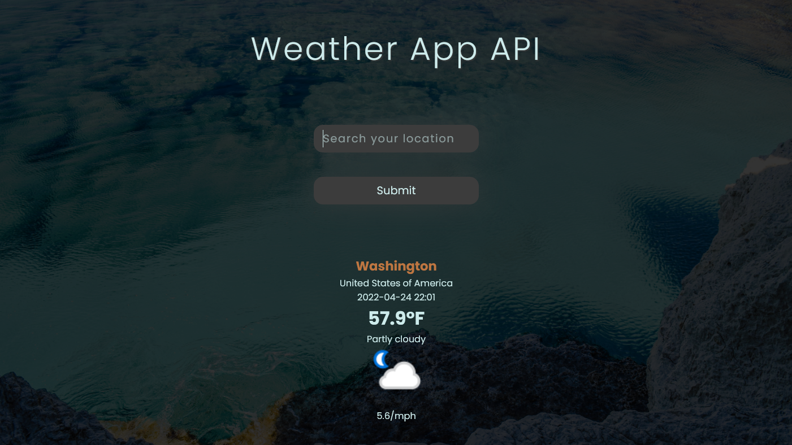

# Weather App API

1) HTML markup
2) Styles using SASS
3) Fetch API from https://www.weatherapi.com/
4) Select DOM elements and change it textContent bease on user's input

  

Background image came from https://www.canva.com/

